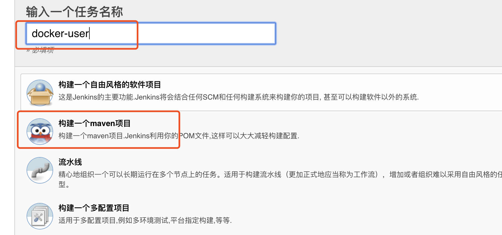
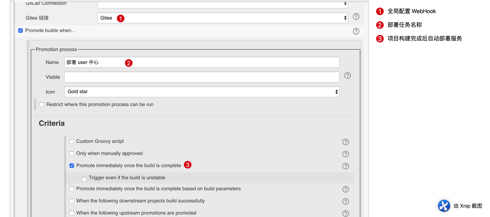
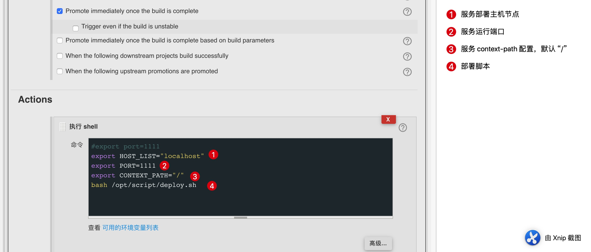
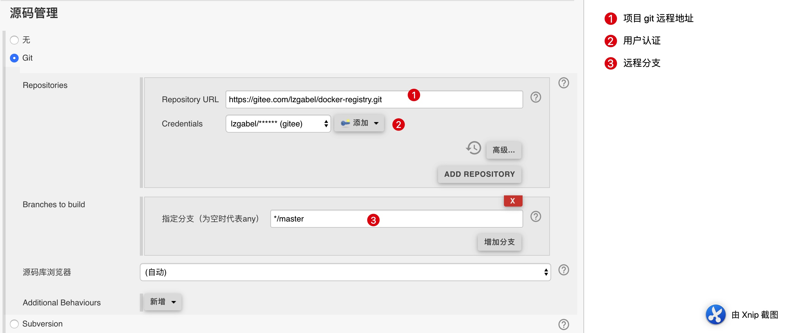
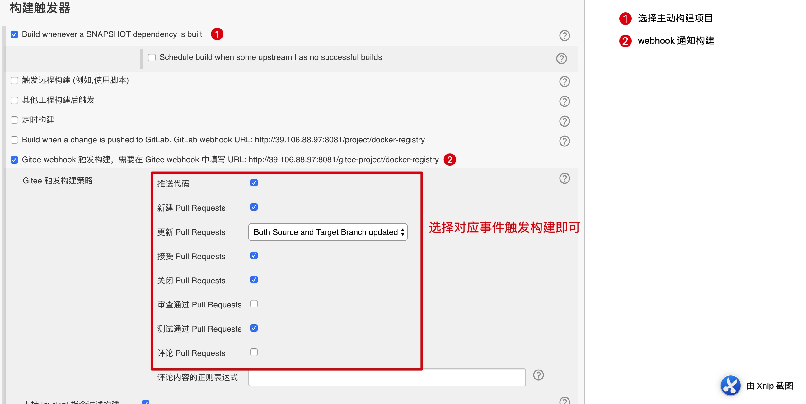
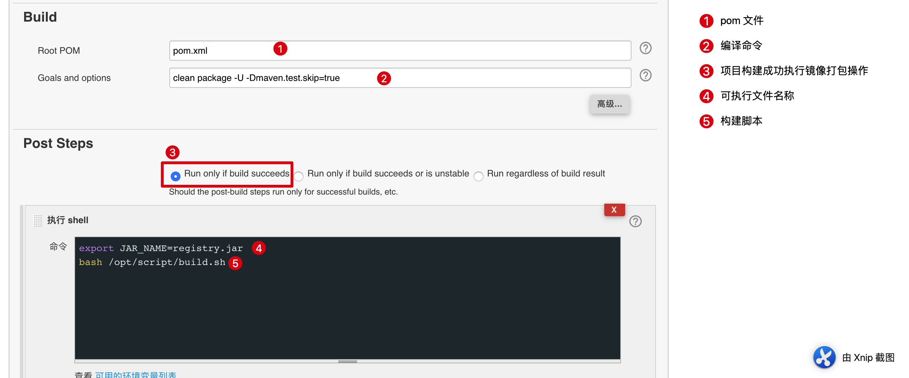
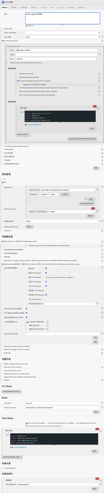
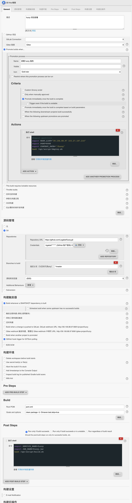

#### 服务创建
1. 新建任务
    * 填写任务名称(当前任务名称即 Docker 服务名称)
    * 选择 maven 项目
    
2. 服务配置
    * 部署任务配置
    
    
    * 源码管理
    
    * 构建触发器
    
    * 构建任务配置
    
    
#### 完整配置

* 完整配置 1

* 完整配置 2
