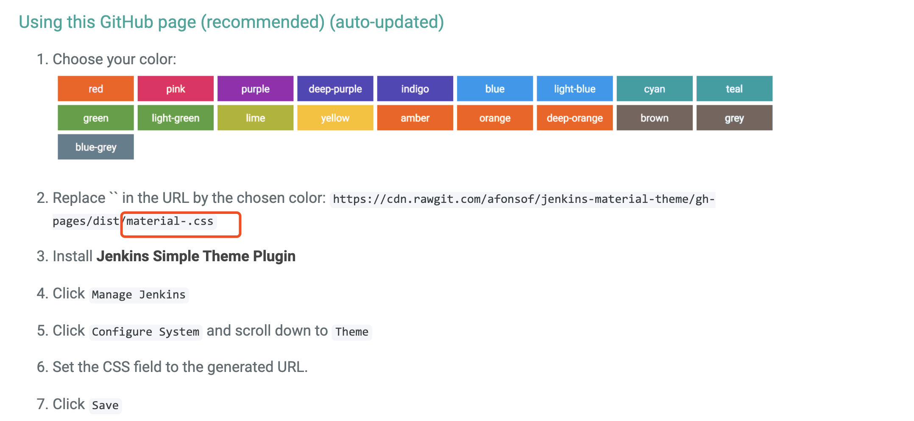
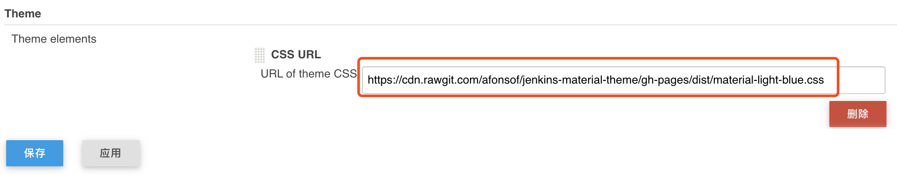
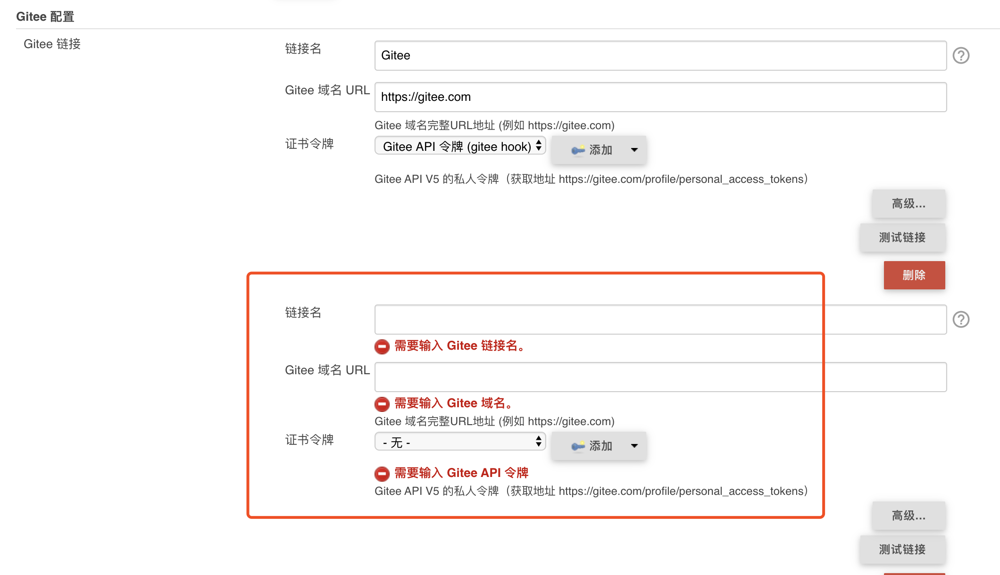
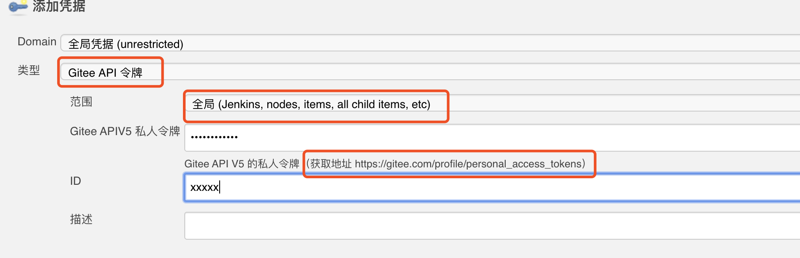

#### Jenkins 安装
1. 安装jenkins
   * [下载链接](https://jenkins.io/zh/download/)
   * 下载对应安装包进行安装，安装完成后访问8080进行初始化
2. 安装插件
    * `maven`
    * `Gitlab` (可选)
    * `Gitee` (可选)
    * `Authentication` (可选)
    * `Simple Theme Plugin` (可选)
    * `Role-Based Strategy` **权限**
      
      * [权限相关设置](https://blog.csdn.net/xuhailiang0816/article/details/80307523)
    * `promoted builds` **手动部署、版本回退**
      * promoted builds(3.2, 3.3有bug)插件
      > `mark: https://repo.jenkins-ci.org/releases/org/jenkins-ci/plugins/promoted-builds/3.2/` 插件地址
3. 安装主题
    * [主题地址](http://afonsof.com/jenkins-material-theme/)
    * 选择对应主题
    
    * 修改系统配置
    
4. Gitlab/Gitee 全局 Webhook 配置 (可选)
    * 添加 Gitee/Gitlab 配置
        * 链接名随便取
        * URL 为代码仓库域名
        * 证书令牌选择步骤二添加ID对应配置
    
    * 证书令牌配置
    
