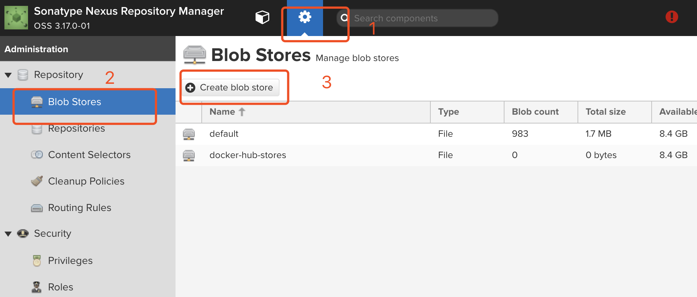
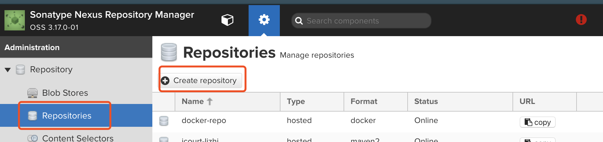
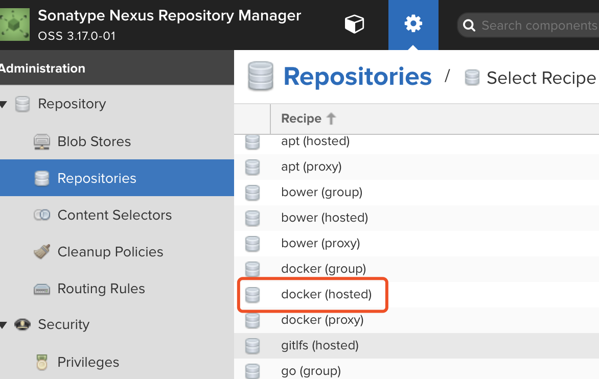
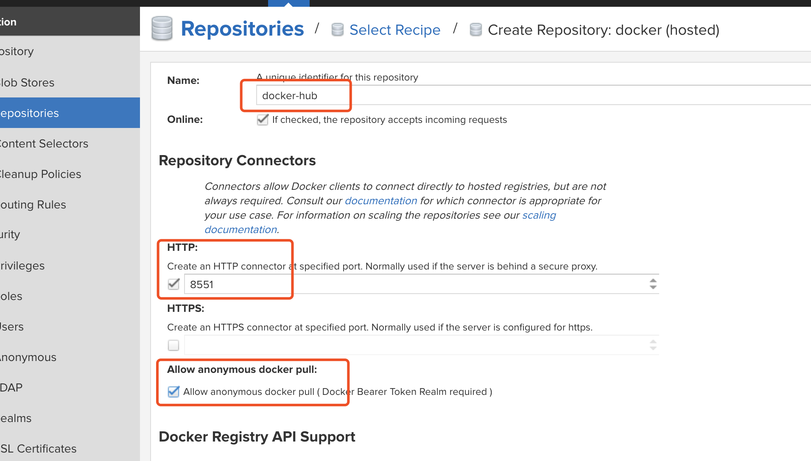
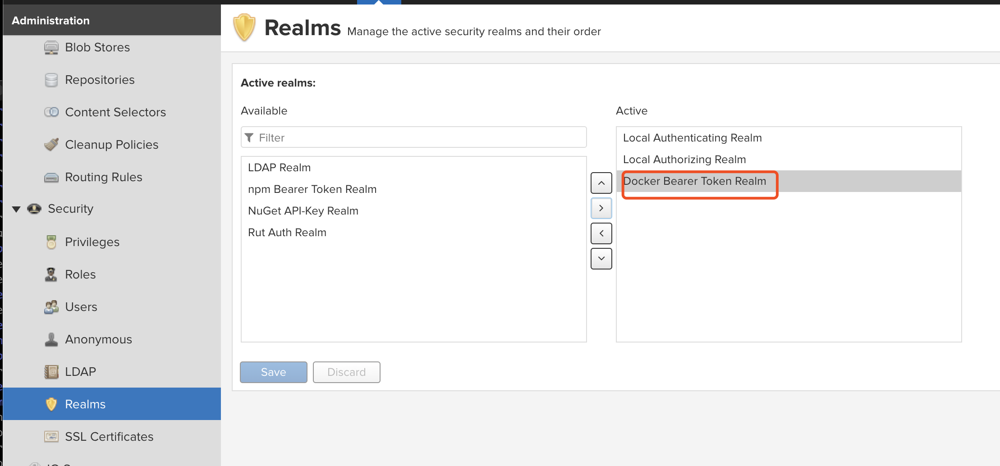
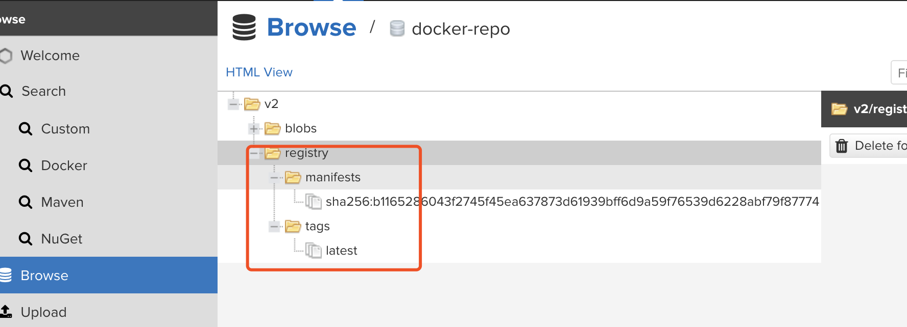

#### 远程镜像私服搭建
* 下载地址
    
    > https://help.sonatype.com/repomanager3/download
* 新建存储

* 新建仓库 [参考](https://www.hifreud.com/2018/06/05/02-nexus-docker-repository/)
  * 选择 hosted/proxy/group 类型
  
  
  * 新建仓库
  
* 激活 realms
  
  
* 配置 `daemon.json`
```
#vi /etc/docker/daemon.json
{
  "insecure-registries": [
    "192.168.59.1:8551" // IP 为对应 nexus 服务 IP
  ],
  "disable-legacy-registry": true
}

service docker restart
```
#### docker image 创建
1. 原来版本新增加 `tag` : `docker tag old:version new:version`
2. 根据 `Dockerfile` 新建
   * `vim Dockerfile`
   * 加入以下内容
   ```
    # 基于openjdk:8
	FROM openjdk:8
	 
	# 指定当前操作目录
	WORKDIR /work/project
	 
	# 容器启动后执行的操作
	CMD java -jar registry.war -server.port=1222
   ```
   * 构建 `docker build -t="image-name" -f /xxx/Dockerfile /source_dir`

### 镜像上传到私服
1. tag 
`docker tag registry:latest 192.168.59.1:8551/registry:latest`
2. 登录
`docker login -u admin -p admin123 192.168.59.1:8551`
3. push
` docker push 192.168.59.1:8551/registry:latest`
4. 上传成功

5. 使用
`docker pull 192.168.58.1:8551/registry:latest`


#### 其他
1. `Jenkins` 部署时出现如下错误信息
> Got permission denied while trying to connect to the Docker daemon socket at unix:///var/run/docker.sock

* 结局方案： `sudo usermod -a -G docker jenkins`


