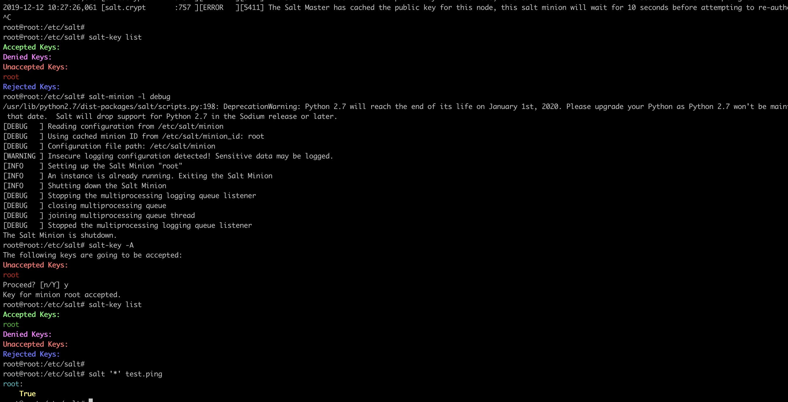
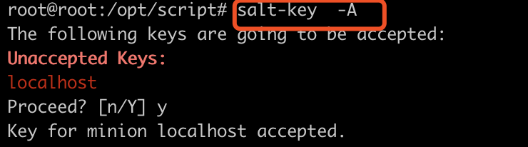
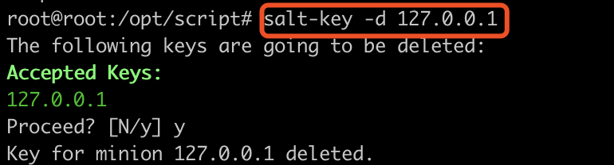

> saltstack 添加 Ubuntu 源
1. 添加秘钥
```
wget -O - https://repo.saltstack.com/apt/ubuntu/16.04/amd64/latest/SALTSTACK-GPG-KEY.pub | sudo apt-key add -
```

2. 添加一下内容到 sources.list 
```
deb http://repo.saltstack.com/apt/ubuntu/16.04/amd64/latest xenial main
deb https://pkg.jenkins.io/debian-stable binary/
```
> saltstack 处理



> Key 的配置
Salt 使用 AES 加密 Master 与 Minion 之间通讯。而如果要想让 Master 认识一个 Minion，这个 Master 就必须接受这个 Minion 的 key。

* 重启 salt-minion，会触发 Minion 把自己的 key 发给 Master。

* 在 Salt Master 上：
```
salt-key -L  # list all the keys
salt-key -A  # accept all the keys
salt-key -D  # delete all the keys
salt-key -R  # reject all pending keys

如果只想对某个 key 进行操作，只需把参数的大写字母换成小写字母。
salt-key -a <keyname>  # accept a specific key
```

[salt 基本操作](http://ohmystack.com/articles/salt-1-basic)


### salt 添加 node 
1. 编辑 `minion` 文件
```
vim /etc/salt/minion
# master 节点
master: 127.0.0.1
# 节点识别id
id: localhost
```

2. 添加节点 `id`: `salt-key -A`


3. 删除节点: `salt-key -d key-id`


#### 异常处理
>Salt request timed out. The master is not responding. You may need to run your command with `--async` in order to bypass the congested event bus. With `--async`, the CLI tool will print the job id (jid) and exit immediately without listening for responses. You can then use `salt-run jobs.lookup_jid` to look up the results of the job in the job cache later.
* 修改 `/etc/salt/master` 文件中 `user=jenkins` 即可

> xxx.xxx.xxx.xxx:
    Minion did not return. [No response]
    
    Error while bringing up minion for multi-master. Is master at xxx.xxx.xxx.xxx responding?

* 解决方案： 
```
1. stop the salt master
2. rm -rf /var/cache/salt/master
3. restart the salt master
4. possibly also restart the minion(s)
```
